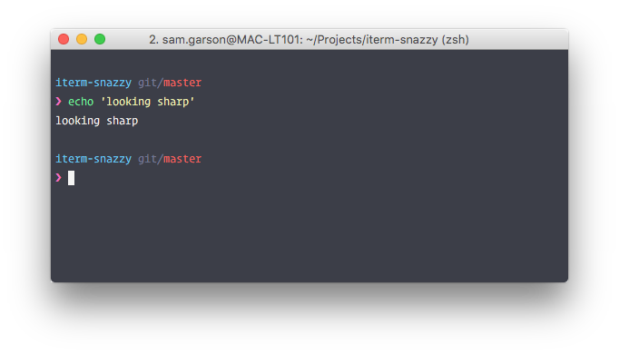

#iterm-snazzy

> Snazzy theme for Item 2

Port of [hyperterm-snazzy](https://github.com/sindresorhus/hyperterm-snazzy) for iTerm 2.

## Install
Open `snazzy.itermcolors` to import, and chose the theme from `Profile > Colors > Color Presets...` to change your current profile.

## Tip
To get the look from the screenshot, use the [zsh-pure](https://github.com/samtgarson/zsh-pure) theme for Oh My Zsh, [zsh-syntax-highlighting](https://github.com/zsh-users/zsh-syntax-highlighting) and [Operator Mono](http://www.typography.com/blog/introducing-operator) font.
